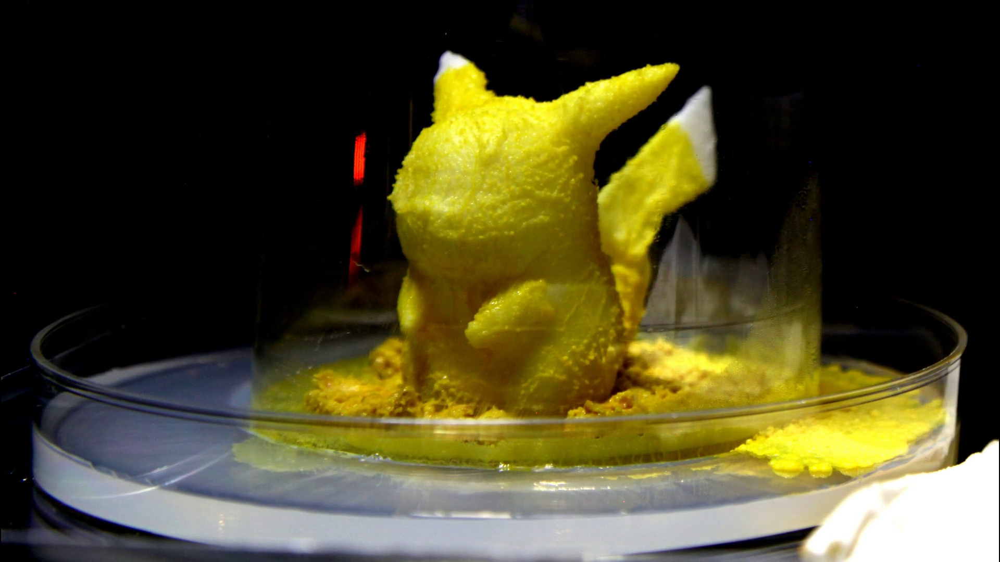

# Dai Akita (秋田 大)

- Research Associate (助教) of [Takahashi Lab.](http://www.ne.t.u-tokyo.ac.jp/index.html), Graduate School of Information Science and Technology, The University of Tokyo
- d.akita /at/ ne.t.u-tokyo.ac.jp
- Interested in information processing in organism, biocomputing, organoid intelligence, and so on.

# Education and Work Experience

|                  |                                                                                                                                     | 
| ---------------- | ----------------------------------------------------------------------------------------------------------------------------------- | 
| 2012/3           | Bachelor of Engineering (School of Engineering, Osaka University)                                                                   | 
| 2014/3           | Master of Engineering (Graduate School of Frontier Biosciences, Osaka University)                                                   | 
| 2017/3           | Doctor of Life Science (Graduate School of Life Science, Hokkaido University) [Doctoral thesis: _Study on biological transport network utilizing plasmodium of Physarum polycephalum_](https://eprints.lib.hokudai.ac.jp/dspace/handle/2115/65418)                                                       | 
| 2017/4 ~ 2022/9  | Mizuho-DL Financial Technology Co., LTD (mainly engaged in consulting services for pension funds as a senior financial engineer) | 
| 2022/10 ~ 2023/3 | Project Researcher (特任研究員), Graduate School of Information Science and Technology, The University of Tokyo                                  | 
| 2023/4 ~         | Research Associate (助教), Graduate School of Information Science and Technology, The University of Tokyo                                  | 

# Publication

1. Akita, D., Schenz, D., Kuroda, S., Sato, K., Ueda, K.-i. and Nakagaki, T., _Current reinforcement model reproduces center-in-center vein trajectory of Physarum polycephalum_, Development, Growth & Differentiation, Wiley Online Library, **2017**, Vol. 59(5), pp. 465-470
1. Fricker, M. D., Akita, D., Heaton, L. L., Jones, N., Obara, B. and Nakagaki, T.,  _Automated analysis of Physarum network structure and dynamics_, Journal of Physics D: Applied Physics, IOP Publishing, **2017**, Vol. 50(25), pp. 254005
1. Kunita, I., Ueda, K.-I., Akita, D., Kuroda, S. and Nakagaki, T.,  _Behavioural differentiation induced by environmental variation when crossing a toxic zone in an amoeba_, Journal of Physics D: Applied Physics, IOP Publishing, **2017**, Vol. 50(35), pp. 354002
1. Akita, D.,  _Multiplication and convolution of distributions for signal processing theory_, Digital signal processing, Elsevier, **2016**, Vol. 56, pp. 1-14
1. Akita, D., Kunita, I., Fricker, M. D., Kuroda, S., Sato, K. and Nakagaki, T.,  _Experimental models for Murray's law_, Journal of Physics D: Applied Physics, IOP Publishing, **2016**, Vol. 50(2), pp. 024001
1. Kameda, S., Hayashida, Y., Tanaka, H., Akita, D., Iwata, A. and Yagi, T.,  _A Multi-Channel Current Stimulator Chip Intended for a Visual Cortical Implant_, Transactions of Japanese Society for Medical and Biological Engineering, Japanese Society for Medical and Biological Engineering, **2013**, Vol. 51(Supplement), pp. R-140
1. Kameda, S., Hayashida, Y., Tanaka, Y., Akita, D. and Yagi, T.,  _A multichannel current stimulator chip for spatiotemporal pattern stimulation of neural tissues_, 2014 36th Annual International Conference of the IEEE Engineering in Medicine and Biology Society, **2014**, pp. 5011-5015

# etc.

- Chartered Member of The Securities Analysts Association of Japan
- Movie of plasmodium of _Physarum polycephalum_ covering 3D printed object 
