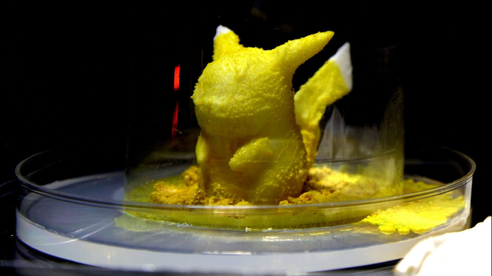

# Dai Akita (秋田 大)

- Assistant Professor (助教) of [Takahashi-Shiramatsu Lab.](http://www.ne.t.u-tokyo.ac.jp/index.html), Graduate School of Information Science and Technology, The University of Tokyo
- d.akita /at/ ne.t.u-tokyo.ac.jp
- Interested in information processing in organism, biocomputing, organoid intelligence, and so on.

# Education and Work Experience

|                  |                                                                                                                                     | 
| ---------------- | ----------------------------------------------------------------------------------------------------------------------------------- | 
| 2012/3           | Bachelor of Engineering (School of Engineering, Osaka University)                                                                   | 
| 2014/3           | Master of Engineering (Graduate School of Frontier Biosciences, Osaka University)                                                   | 
| 2017/3           | Doctor of Life Science (Graduate School of Life Science, Hokkaido University) [Doctoral thesis: _Study on biological transport network utilizing plasmodium of Physarum polycephalum_](https://eprints.lib.hokudai.ac.jp/dspace/handle/2115/65418)                                                       | 
| 2017/4 ~ 2022/9  | Mizuho-DL Financial Technology Co., LTD (mainly engaged in consulting services for pension funds as a senior financial engineer) | 
| 2022/10 ~ 2023/3 | Project Researcher (特任研究員), Graduate School of Information Science and Technology, The University of Tokyo                                  | 
| 2023/4 ~         | Assistant Professor (助教), Graduate School of Information Science and Technology, The University of Tokyo                                  | 

# Publication

1. D. Akita and D. Schenz, _Parity conditions for one-way rail networks_, Discussiones Mathematicae Graph Theory, **2026**, Vol. 46(3), p. 867. [doi: 10.7151/dmgt.2632](https://doi.org/10.7151/dmgt.2632)
1. N. Ikeda, D. Akita, and H. Takahashi, _Emergent functions of noise-driven spontaneous activity: homeostatic maintenance of criticality and memory consolidation_, Frontiers in Neural Circuits, vol. 19, **2025**. [doi: 10.3389/fncir.2025.1585087](https://doi.org/10.3389/fncir.2025.1585087)
1. Z. Zhang, A. Yaron, D. Akita, T. I. Shiramatsu, Z. C. Chao, and H. Takahashi, _Deviance detection and regularity sensitivity in dissociated neuronal cultures_, Frontiers in Neural Circuits, vol. 19, **2025**. [doi: 10.3389/fncir.2025.1584322](https://doi.org/10.3389/fncir.2025.1584322)
1. A. Yaron, Z. Zhang, D. Akita, T. I. Shiramatsu, Z. C. Chao, and H. Takahashi, _Dissociated neuronal cultures as model systems for self-organized prediction_, Frontiers in Neural Circuits, vol. 19. **2025**. [doi: 10.3389/fncir.2025.1568652](https://doi.org/10.3389/fncir.2025.1568652)
1. T. Mayama, D. Akita, W. Kawakami, and H. Takahashi, _Online Chat with Living Neuronal Cultures_, SIGGRAPH Asia 2024 Real-Time Live!, **2024**, Tokyo, Japan. [doi: 10.1145/3681757.3697053](https://doi.org/10.1145/3681757.3697053)
1. D. Akita, E. Suwa, N. Ikeda, and H. Takahashi, _Neural Activity and Information Processing Capacity of Neuronal Culture_, the 45th Annual International Conference of the IEEE Engineering in Medicine and Biology Society (EMBC), **2023**, T6-O1.Th_1330 654, Sydney, Australia. [doi: 10.1109/EMBC40787.2023.10340168](https://doi.org/10.1109/EMBC40787.2023.10340168)
1. N. Ikeda, D. Akita, and H. Takahashi, _Noise and spike-time-dependent plasticity drive self-organized criticality in spiking neural network: Toward neuromorphic computing_, Applied Physics Letters, **2023**, Vol. 123(2), p. 023701. [doi: 10.1063/5.0152633](https://doi.org/10.1063/5.0152633)
1. N. Ishida, T. I. Shiramatsu, T. Kubota, D. Akita, and H. Takahashi, _Quantification of information processing capacity in living brain as physical reservoir_, Applied Physics Letters, **2023**, Vol. 122(23), p. 233702. [doi: 10.1063/5.0152585](https://doi.org/10.1063/5.0152585)
1. D. Akita, D. Schenz, S. Kuroda, K. Sato, K.-i. Ueda, and T. Nakagaki, _Current reinforcement model reproduces center-in-center vein trajectory of Physarum polycephalum_, Development, Growth & Differentiation, Wiley Online Library, **2017**, Vol. 59(5), pp. 465-470. [doi: 10.1111/dgd.12384](https://doi.org/10.1111/dgd.12384)
1. M. D. Fricker, D. Akita, L. L. Heaton, N. Jones, B. Obara, and T. Nakagaki, _Automated analysis of Physarum network structure and dynamics_, Journal of Physics D: Applied Physics, IOP Publishing, **2017**, Vol. 50(25), pp. 254005. [doi: 10.1088/1361-6463/aa72b9](https://doi.org/10.1088/1361-6463/aa72b9)
1. I. Kunita, K.-i. Ueda, D. Akita, S. Kuroda, and T. Nakagaki, _Behavioural differentiation induced by environmental variation when crossing a toxic zone in an amoeba_, Journal of Physics D: Applied Physics, IOP Publishing, **2017**, Vol. 50(35), pp. 354002. [doi: 10.1088/1361-6463/aa7a8e](https://doi.org/10.1088/1361-6463/aa7a8e)
1. D. Akita, _Multiplication and convolution of distributions for signal processing theory_, Digital signal processing, Elsevier, **2016**, Vol. 56, pp. 1-14. [doi: 10.1016/j.dsp.2016.05.008](https://doi.org/10.1016/j.dsp.2016.05.008)
1. D. Akita, I. Kunita, M. D. Fricker, S. Kuroda, K. Sato, and T. Nakagaki, _Experimental models for Murray's law_, Journal of Physics D: Applied Physics, IOP Publishing, **2016**, Vol. 50(2), pp. 024001. [doi: 10.1088/1361-6463/50/2/024001](https://doi.org/10.1088/1361-6463/50/2/024001)
1. S. Kameda, Y. Hayashida, H. Tanaka, D. Akita, A. Iwata, and T. Yagi, _A Multi-Channel Current Stimulator Chip Intended for a Visual Cortical Implant_, Transactions of Japanese Society for Medical and Biological Engineering, Japanese Society for Medical and Biological Engineering, **2013**, Vol. 51(Supplement), pp. R-140. [doi: 10.11239/jsmbe.51.R-140](https://doi.org/10.11239/jsmbe.51.R-140)
1. S. Kameda, Y. Hayashida, Y. Tanaka, D. Akita, and T. Yagi, _A multichannel current stimulator chip for spatiotemporal pattern stimulation of neural tissues_, 2014 36th Annual International Conference of the IEEE Engineering in Medicine and Biology Society, **2014**, pp. 5011-5015. [doi: 10.1109/EMBC.2014.6944750](https://doi.org/10.1109/EMBC.2014.6944750)

# Preprint

1. K. Takehana, D. Akita, and H. Takahashi, _Dynamic sampling of non-stationary spontaneous activity in dissociated neuronal networks_, [arXiv:2607.24269](https://arxiv.org/abs/2607.24269), **2026**.
1. T. Mayama and D. Akita, _Finite-state enumeration of adjacency-constrained 132-avoiding permutations_, [arXiv:2605.23519](https://arxiv.org/abs/2605.23519), **2026**.
1. T. Mayama, S. Shimizu, Y. Takano, D. Akita, and H. Takahashi, _Bridging integrated information theory and the free-energy principle in living neuronal networks_, [arXiv:2510.04084](https://arxiv.org/abs/2510.04084), **2025**.
1. Z. Zhang, A. Yaron, D. Akita, T. I. Shiramatsu, Z. C. Chao, and H. Takahashi, _Emergence of deviance detection in cortical cultures through maturation, criticality, and early experience_, [arXiv:2510.00764](https://arxiv.org/abs/2510.00764), **2025**.
1. D. Akita, _An unbiased variance estimator with denominator N_, [arXiv:2504.06569](https://arxiv.org/abs/2504.06569), **2025**.
1. A. Nakamuta, D. Akita, H. Zhang, Y. Kawahara, H. Takahashi, and J. Teramae, _Self-organization of high-dimensional geometry of neural activity in culture_, bioRxiv, **2025**. [doi: 10.1101/2025.01.14.630383](https://doi.org/10.1101/2025.01.14.630383)

# etc.
- Can the toy train turn around? Count the angles! 
  <iframe
    style="width: 100%; max-width: 560px; aspect-ratio: 16 / 9;"
    src="https://www.youtube-nocookie.com/embed/7PHZ4Swf9j8"
    title="Can the toy train turn around? Count the angles!"
    frameborder="0"
    allow="accelerometer; autoplay; clipboard-write; encrypted-media; gyroscope; picture-in-picture; web-share"
    allowfullscreen>
  </iframe>
- [_Online Chat with Living Neuronal Cultures_, SIGGRAPH Asia 2024 Tokyo (Real-Time Live!), 2024/12/6](https://asia.siggraph.org/2024/ja/presentation/?id=real_128&sess=sess208) 
- Chartered Member of The Securities Analysts Association of Japan
- Movie of plasmodium of _Physarum polycephalum_ covering 3D printed object 
- [clock](clock.html)
